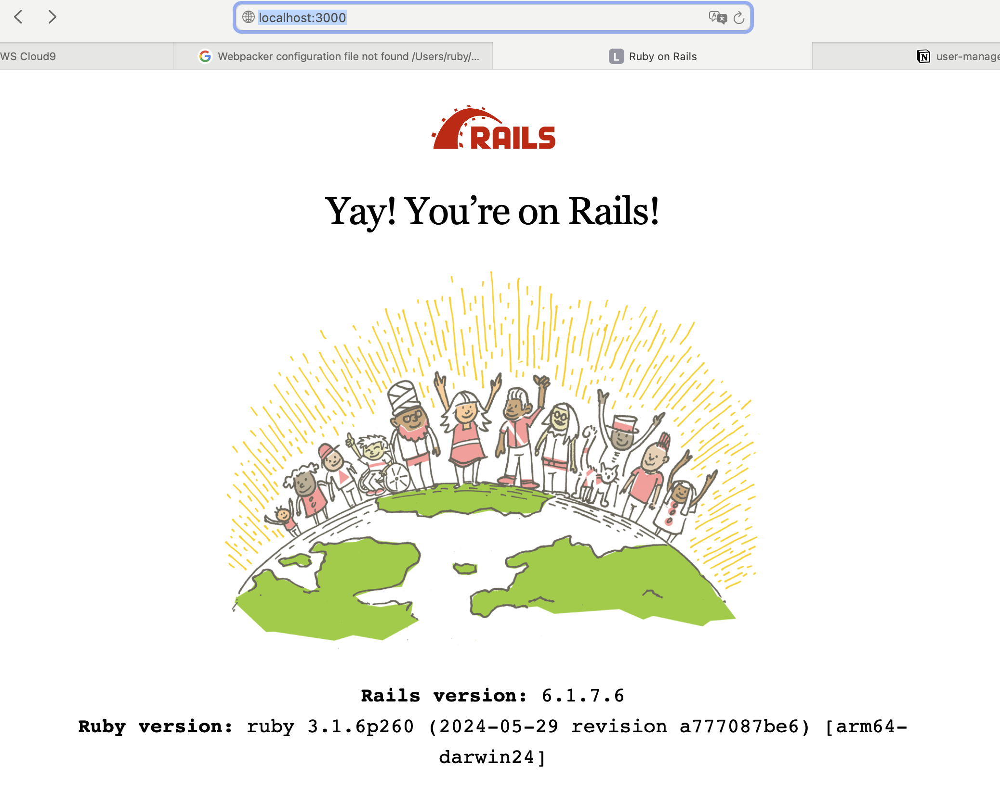

# user-management

# **Development Version**

Ruby 3.1.6

Rails 6.1.7.6

```jsx
bin/rails server
```

Start the server and confirm that there are no errors. Then, check [**http://localhost:3000**](http://localhost:3000/) to verify that the current version information is displayed correctly.



# Troubleshooting

When creating and starting a new project I encountered some errors. I have documented them below for reference.

### Issue: installing Rails 6.1.7.6, any command results in an error.


### Solution

Force the version in `Gemfile` to **not exceed 1.3.4**

[https://stackoverflow.com/questions/79360526/uninitialized-constant-activesupportloggerthreadsafelevellogger-nameerror](https://stackoverflow.com/questions/79360526/uninitialized-constant-activesupportloggerthreadsafelevellogger-nameerror)

### Issue: Webpacker configuration file not found


### Solution

install web packer

```jsx
npm install --global yarn
rails webpacker:install
```
