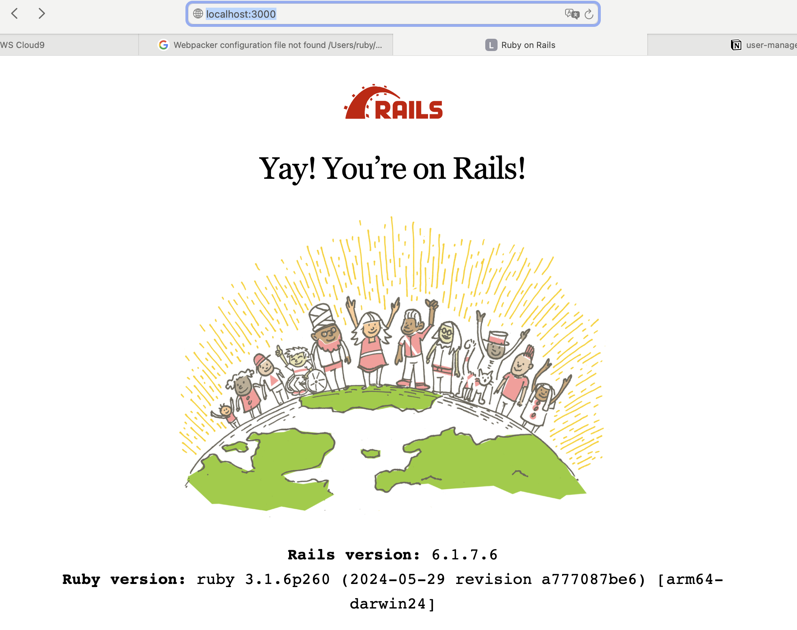

# user-management

> a ruby on rails practice project

[quick note](https://hackmd.io/@wasabi-neko/Syf9TQncyx)

## Run in dev

Require `redis`, `sideqik`, `mailcatcher`

```shell
bin/bundle exec mailcatcher
bin/bundle exec sideqik
```

```shell
brew service start redis
```


```shell
bin/rails server
```

## Structure

### Model

```
User has_many Roles through user_roles
Role has_many Permissions through role_permissions
```

### Route & Permission

Use `devise` default routing `/auth/register/*` for edit/destroy current user
Use `/user/edit` for admin to edit user profiles

### Testing

Before running the test, `mailcatcher` needs to be running in background
> I ues mailcatcher to catch the mail locally

```shell
bin/bundle exec mailcatcher
```

run the test

```shell
rails test
```

run with coverage

```shell
rails test:coverage
```

check the coverage result at `converage/index.html`

## Requirement

1. User & Role Management

   Implement full CRUD operations for users.
   Users will have the following attributes:
   first_name, last_name, email, job_title, phone_number (with format validation), password (handled via devise).
   Only admins can create, update, or delete other users.
   Managers can view all users but cannot modify their data.
   Regular users can only view their own profile.

2. Authentication

   Use the devise gem for authentication.
   Users must sign in to access the system.
   Implement password reset functionality via devise.

3. Authorization

   Use cancancan to define and manage user permissions.
   Users can have multiple roles (admin, manager, regular user).
   Define access control:
   Admins can manage all users, including assigning roles.
   Managers can view all users but cannot modify them.
   Regular users can only view and edit their own profiles.

4. Email Verification

   After user registration, send a verification email with a confirmation link.
   Users must verify their email before accessing the system.
   Implement an email re-verification process in case the email is not confirmed.

5. Email Notifications

   Use Sidekiq for background email processing.
   Admins receive a notification when a new user registers.

# **Development Version**

Ruby 3.1.6

Rails 6.1.7.6

```jsx
bundle install
bin/rails server
```

Start the server and confirm that there are no errors. Then, check [**http://localhost:3000**](http://localhost:3000/) to verify that the current version information is displayed correctly.



# Troubleshooting

When creating and starting a new project I encountered some errors. I have documented them below for reference.

### Issue: installing Rails 6.1.7.6, any command results in an error.


### Solution

Force the version in `Gemfile` to **not exceed 1.3.4**

[https://stackoverflow.com/questions/79360526/uninitialized-constant-activesupportloggerthreadsafelevellogger-nameerror](https://stackoverflow.com/questions/79360526/uninitialized-constant-activesupportloggerthreadsafelevellogger-nameerror)

### Issue: Webpacker configuration file not found


### Solution

install web packer

```jsx
npm install --global yarn
rails webpacker:install
```
